# The Deployment of LaTeX Dev Env
# LaTeX开发环境的部署

## TeX Live + TeXStudio环境的安装
(本文含有大量超链接，请按住Ctrl点击链接，这样可以在新窗口打开链接)
### 对于广大Windows用户
#### 安装TeX Live环境
下载安装包大约3点多个G，因此为了快速下载不推荐去国外的地址下载。在这里提供一个ustc的镜像站，[点击这里进去下载texlive.iso](http://mirrors.ustc.edu.cn/CTAN/systems/texlive/Images/)，用校园网下载大约20分钟。

下载完成之后是iso磁盘镜像文件，不推荐用压缩软件解压。用Win10的资源管理器打开。这么做的目的有两方面：首先是解压浪费时间，其次是解压浪费磁盘空间。直接令Windows创建虚拟磁盘然后挂载镜像是最好的方式。

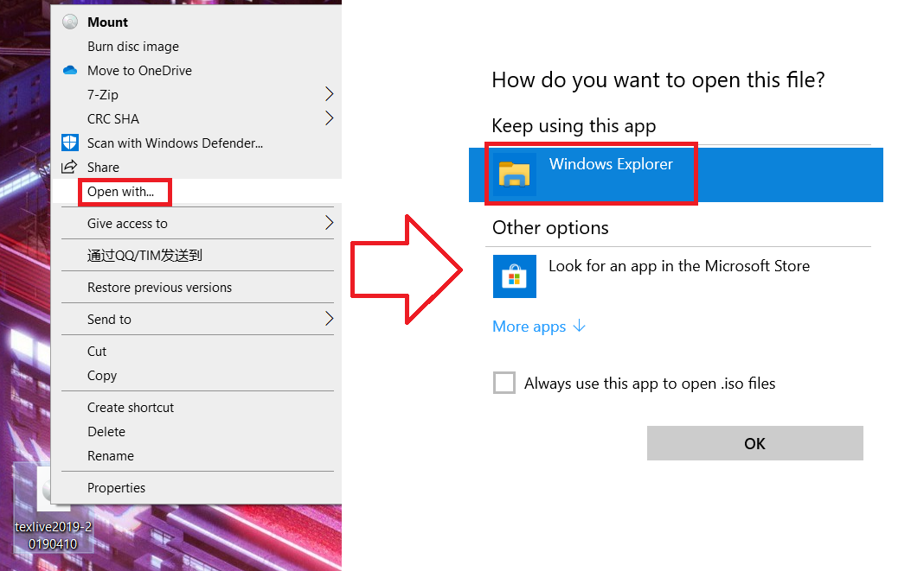

双击install-tl-windows安装，UAC管理员权限弹窗请允许。当然我的Win10设置了UAC永不弹窗，为了方便。

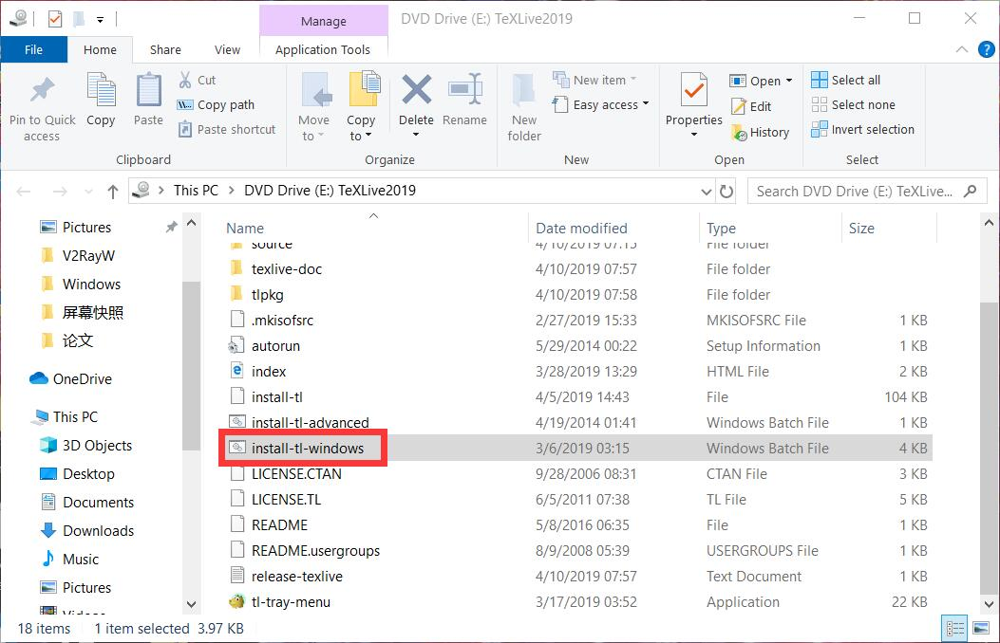

安装完记得umount

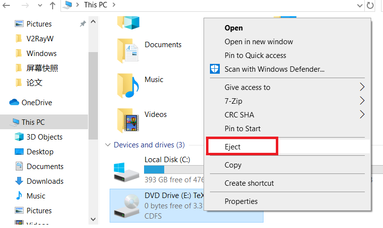

#### 安装TeXStudio
去GitHub下载TeXStudio [点击前往GitHub](https://github.com/texstudio-org/texstudio)

考虑到有相当一部分人连GitHub都不会使，连下个安装程序都不会，我还是在这里说一下吧

要点这里，Release

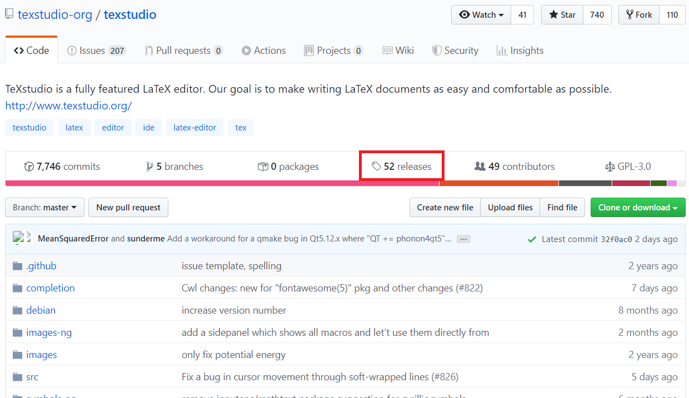

再点这个，exe安装程序

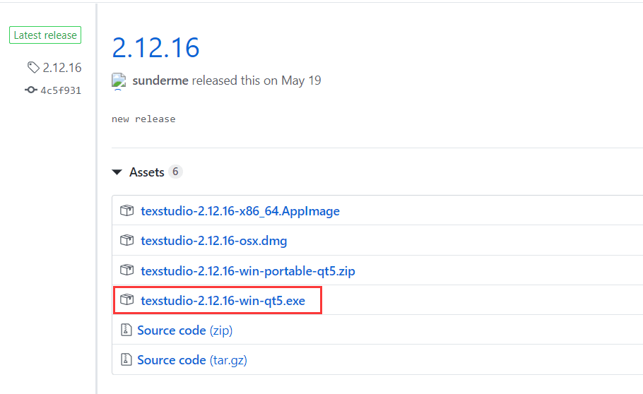

### 对于像我这样的少数Linux用户
以Arch Linux为例，直接在包管理器里面搜索texlive和texstudio然后安装。

TeX Live检索结果

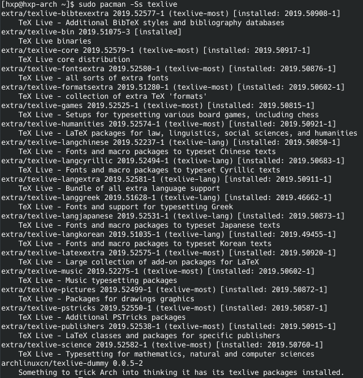

TeXStudio检索结果

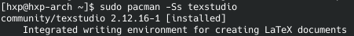

运行`sudo pacman -S texlive-most texlive-lang texstudio`然后等待安装完成

## TeXStudio安装的后期配置

[请先读文档! RTFM!](http://texstudio.sourceforge.net/manual/current/usermanual_en.html#SECTION113)

首先，更改默认编译器为XeLaTeX。因为XeLaTeX支持中文。
Options -> Configure TeXStudio里

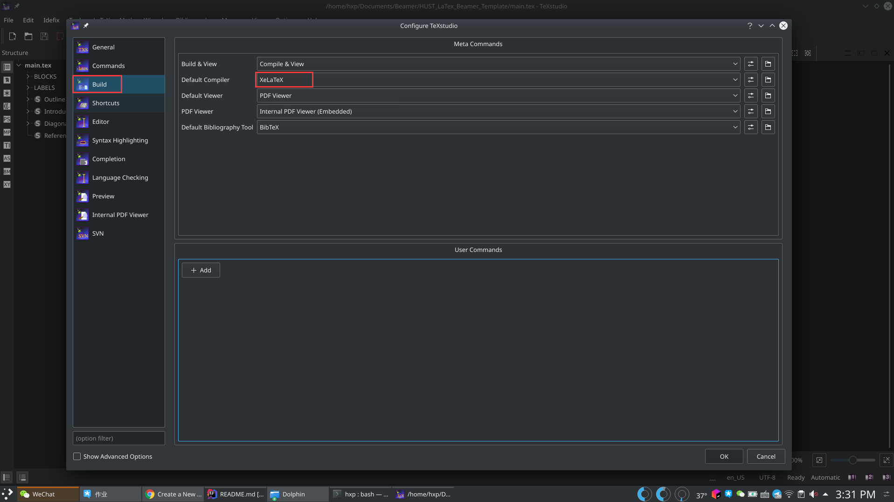

之后建议默认自动补全设置为模糊

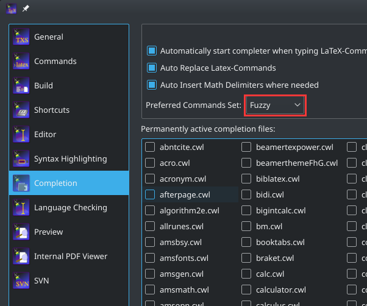

设置的前后对比

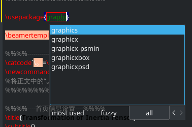 

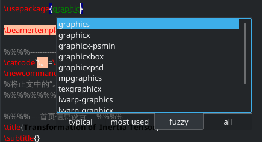

这样做对于初学者是友好的，尤其是记不住包名和指令的人。

~~下边这个Windows用户可以忽略~~

语法高亮配色的选取：众所周知，IDE设置一个好的语法高亮不仅能更清楚地区分代码中的语法成分，还能防止疲劳。在这里设置

**进阶技巧：Hack字体的配置**

好的字体能在美观的同时方便程序员区分l，I，和1。Hack字体是一种开源字体，被认为是比Consolas更好的最佳变成字体。

[点击这里跳转到Hack字体的GitHub主页](https://github.com/source-foundry/Hack)

[点击这里下载Windows字体安装程序](https://github.com/source-foundry/Hack-windows-installer/releases/tag/v1.6.0)

安装字体后重启，在这里启用字体

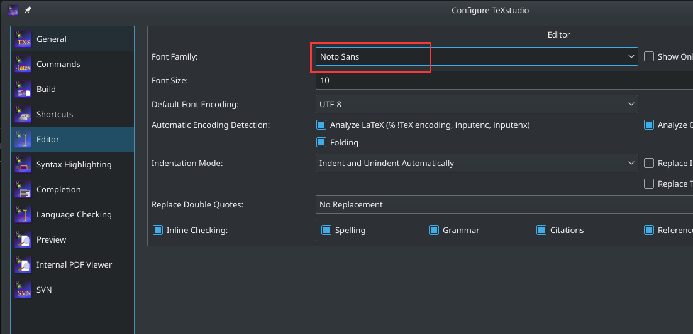

## Linux + TeX Live + Emacs + AUCTeX + CDLatex + YASnippet环境的介绍

我不会像上边那样讲这个环境是如何安装的，因为如果你不知道去Google，或者Google不出可以看得懂的教程，那我会建议你放弃使用Linux和Emacs的念头。

算了，放个懒人包：

[点击访问我GitHub上的Emacs配置文件备份](https://github.com/XipingHu/.emacs.d)

[Windows下懒人包点这里](https://github.com/XipingHu/Emacs-Win10-Install-Guide)

如果你看不懂这个为什么是懒人包以及怎么用，说明你没有学习Emacs，请自行Google学习。

### Emacs简介

#### 神器的传说
在这个蔚蓝色的星球上，流传着两大神器的传说： 据说Emacs是神的编辑器，而Vim是编辑器之神。追求独步天下的高手和低手们争着一睹它们的风采，可看到它们朴素单薄的界面后，不禁心下怀疑：这就是神器吗？甚至有人生了轻视之心。肤浅的人嗤之以鼻，说：什么年代了，还抱着这么老土的玩意不放，真他妈Geek！同学，请冷静下来，听我说：它们的确够老了，都几十年的寿命了，但你想想为什么，为什么这么古老的编辑器，却有越来越多的人皈依它们。

曾几何时，Windows用户对软件的可扩展性没有概念，他们只能对他们使用的软件进行非常有限的定制。扩展软件的权利保留在软件开发者手中。软件的使用者如果想要新的功能和特性，只能等待软件的升级。有能力的用户等不及了，为了添加自己想要的功能，从0开始写了一款新的软件。就这样，新的功能意味着新的软件，Windows下的软件前赴后继，迅速地更新换代着。因此，Windows下的软件都很短命。

Linux和开源软件渐渐流行起来，人们才发现：可扩展性才能给软件强大的生命。在MS的VS横行的今天，Eclipse为什么被评为最好的IDE？就是因为它在IDE中最具可扩展性。在IE几乎一统天下的时候，为什么Firefox能夺走越来越多的用户，也是因为它的可扩展性。提供了良好的扩展接口，用户自然会写出各种各样的插件，来满足用户自己形形色色的要求。这样，软件在用户的推动下自然变得强大了。

Emacs和Vim没有被时代淘汰，反而越发强大，也正是因为在数不清的编辑器中，他们具有无可匹敌的可扩展性。

有句夸张的话说：Emacs是伪装成编辑器的操作系统。细细想来，这句话并不夸张。

Emacs其实是个Lisp的解释器，因此可以用Lisp灵活地扩展。Lisp是什么东西，这同样是种很有生命力的编程语言。在C语言还没有发明的年代，MIT的人工智能实验室写ITS操作系统时，一部分用的是汇编语言，还有一部分就是用的Lisp。现在，Lisp仍在人工智能研究领域广泛使用着。

有这么牛逼的扩展语言，注定Emacs向着无所不能的方向发展。渐渐地，人们用Emacs不再限于写程序，写文档，而且在Emacs里管理文件系统，运行终端，收邮件，上网，听音乐……，真是一发不可收拾。甚至，有人用Emacs控制咖啡机煮咖啡。

Vim是Vi最受欢迎的变种之一，除了继承了Vi迅捷的编辑方式，Vim的功能已经比原始的Vi强大得多。这也得益于它可以用Vim脚本无限地扩展。Vim.org 上已经有数千个脚本了，给Vim增加各种各样的特性和功能。

为了证明Vim的可扩展性不输于Emacs，也有用户写了在Vim中玩游戏、运行Shell、和集成GDB在Vim内部调试的插件。客观地讲，Vim的脚本语言与Emacs的ELisp相比，略显逊色，但这丝毫不妨碍它把Vim扩展成非常优秀的编辑器。

海纳百川，有容乃大。Emacs和Vim通过别的编辑器无法比肩的可扩展性，不断吸收广大用户的智慧，是它们能成为“神器”的原因之一。

#### 为什么选择Emacs/Vim：黑客的编辑器，为编程而生

Vim的前身Vi的作者Bill Joy和Emacs的作者Richard Stallman都是那个时代著名的黑客，所以这两款编辑器一开始面向的主要用户就是写程序的人，现在仍然是。它们对编程加入了越来越多的支持，如语法高亮、智能缩进、关键字补全甚至集成调试。也有越来越多的程序员从IDE转向了Vim和Emacs。

用Vim和Emacs编程到底有什么好处？我想首先是它们高效的编辑操作会提高你的编程效率。其次你可以用它们完成各种语言的编程，所谓一剑在手，夫复何求。你不用再因为编程语言不同去学习不同的IDE的使用，那些庞大的IDE的升级换代也与你再不相关，你把精力用于学习编程语言本身就好了。听说Google和微软内部开发也都不用IDE的，他们也会用Emacs或Vim。

因为我写的程序不多，还不能深入体会用Vim或Emacs开发程序的乐趣。我只是觉得这很酷，你看，Linux之父Linus多年来用的是一款MicroEmacs，它比GNU Emacs或XEmacs少许多功能，但Linus就是用它在维护Linux。 微软的大牛Don Box，Com之父，一直用Emacs，他说谁也不能夺走他的编辑器。他还在网上放了一段他用Emacs写C#程序的视频。

编程大师们的选择，也是Emacs和Vim被追捧为神器的原因之一。

#### 跨越世纪的圣战

Vim用户和Emacs用户有着旗鼓相当的品位，应该互相欣赏才对。现实却是，忠诚于Vim的用户和忠诚于Emacs的用户互不相容，常常没完没了地打口水仗。Emacs用户说Vim的操作方式单一而古怪，Vim用户说Emacs体积庞大，启动缓慢。

很有点一山不容二虎的意思，大概因为二者都处于神器的高度，才会斗争不断吧。也可能是因为二者截然不同的设计哲学吸引的用户在价值观上也互不认同。

正因为两者难分高下，新人总是在Vim和Emacs之间犹豫不定，很难决定到底要皈依哪一个神。

P.S.上面的内容来自[这里](https://linuxtoy.org/archives/why-emacs-vim-good.html)

### 现在就尝试Emacs！

[Emacs官网下载（Linux，Windows，Mac）](https://www.gnu.org/software/emacs/)

免费学习：
* [GNU Emacs Manual](https://www.gnu.org/software/emacs/manual/html_node/emacs/index.html)
* [An Introduction to Programming in Emacs Lisp](https://www.gnu.org/software/emacs/manual/html_node/eintr/index.html)
* [Emacs Lisp Reference Manual](https://www.gnu.org/software/emacs/manual/html_node/elisp/index.html)

### 写LaTeX使用的Emacs插件介绍

#### 核心插件：AUCTeX

AUCTeX是在Emacs中添加LaTeX支持的插件，它可以在Emacs中编译、预览LaTeX。（注意TeXStudio不能预览）

编译只需要按`C-c C-c`，手快的同学非常方便。并且在编译完成后可以自动刷新预览窗口。编译前同样要设置编译引擎为xetex，用`M-x TeX-engine-set RET`命令。记得输完命令敲下`TAB`，有自动补全。

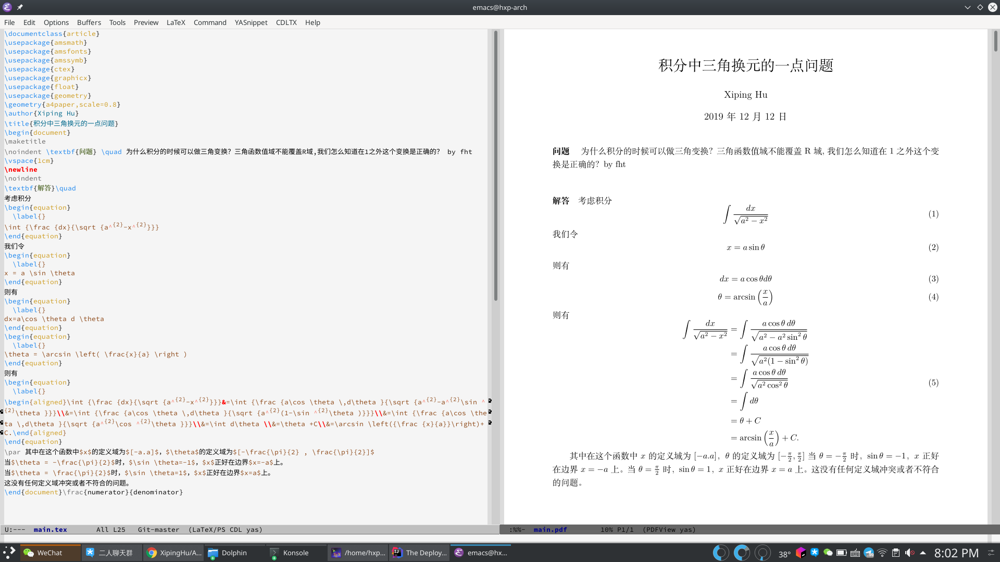

其中我用的内嵌式pdf浏览器来浏览pdf。可以设置成别的pdf阅读器，譬如说Okular

AUCTeX在浏览pdf的同时支持从定位定位，按下`C-c C-v`就可以

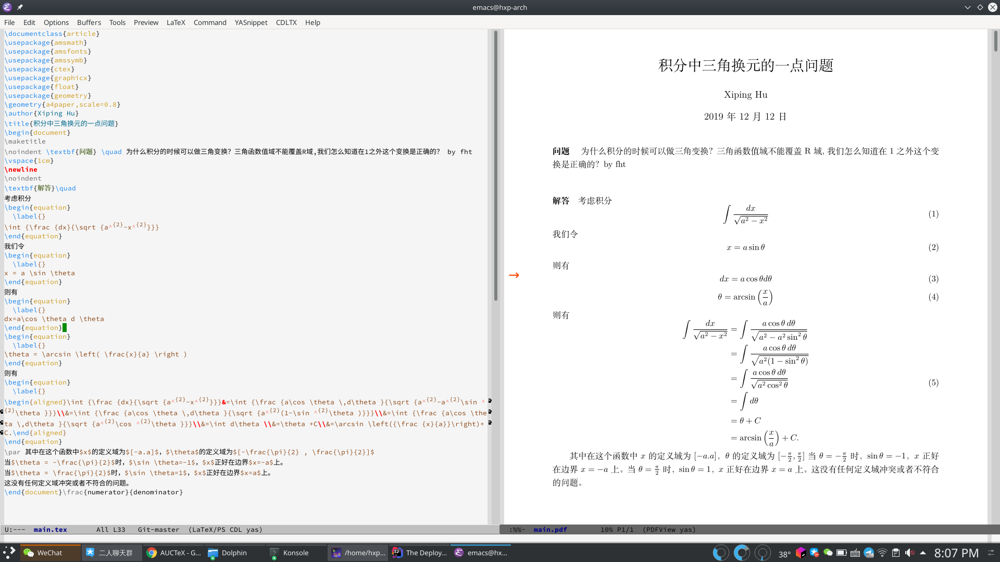

我在光标处按下了`C-c C-v`，右侧文档出现了箭头。

下面是AUCTeX预览功能的展示，对着公式按下`C-c C-c C-p`

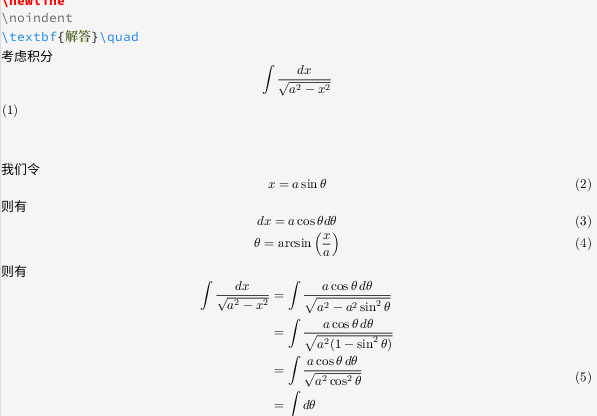

有一点需要注意的就是预览功能仅支持部分Emacs主题，譬如说whiteboard。用`M-x load-theme RET`命令

#### 辅助插件：CDLatex

CDLatex插件使得公式里面的上下标更像上下标，即上标部分的代码显示在上面，下标部分的代码显示在下面。

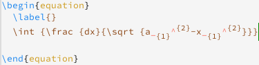

同时，CDLatex会自动补全括号，在你打左边括号的同时会自动打上右边对应的括号。

除此之外，CDLatex加速希腊字母的输入。在按下<code>&#96;</code>的时候如果不做操作，就会弹出帮助界面。按<code>&#96;</code>翻页。

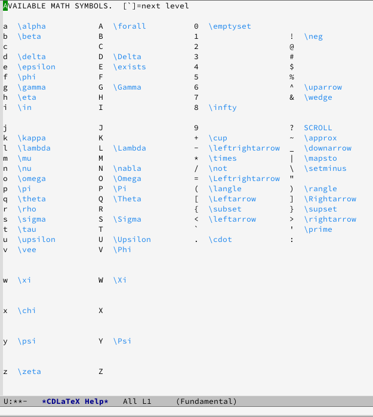

如图，这个界面下再按<code>&#96;l</code>会输入<code>\lambda</code>。当然你可以在这个界面弹出之前按<code>l</code>来输入<code>\lambda</code>。

#### YASnippet：用模板提升编辑效率

YASnippet基本上是每个Emacs用户必装的插件。用户可以预先存储模板文件，然后通过在编辑文件中输入特定字母然后按`TAB`召唤模板。

YASnippet不仅可以在LaTeX中使用，在任何编程语言中都可以使用。

下面是我写的一个模板示例

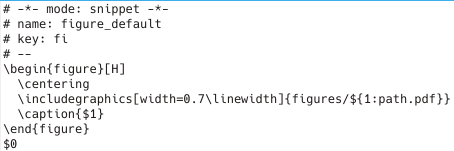

当我在编辑LaTeX时，如果想插入图片，那我就直接在文件中输入`fi TAB`，Emacs会将`fi`替换为以上模板，并且把光标移到`$1`的位置，等待我输入图片文件的名称。

在我输入图片文件名称的同时，Emacs会实时地将我的输入和下面图片标题那的`$1`同步，我在图片文件名里输入的东西会原封不动地复制到图片标题的位置。

当我完成输入后，我再次按下`TAB`，光标会跳转到`$0`的位置。

YASnippet的很多常用模板可以通过MELPA下载，可以在Emacs里执行命令`M-x list-packages RET`之后用`C-s`和`C-r`搜索找一找`yasnippet-snippets`这个插件，安装上。

## 胡氏德沃夏克键位：从键盘布局层面提高编程速度

### 什么是胡氏德沃夏克键位
众所周知，正常键盘的QWERTY键位最初的设计意图是为了降低打字员的打字速度，防止打字员打字太快导致打自己故障。这在现在显然是糟糕的设计。而且这种键位左右手负载不均衡。详见下面这张键盘热区图。

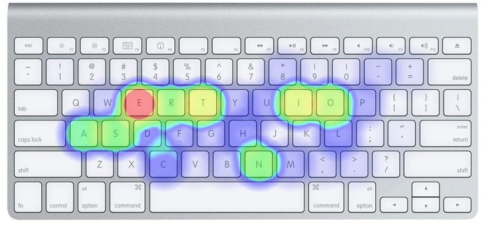

这显然不是我们想要的，同时我们希望常用的字母都分配在中间一排，这样我们不用移动手指。于是德沃夏克键位就诞生了

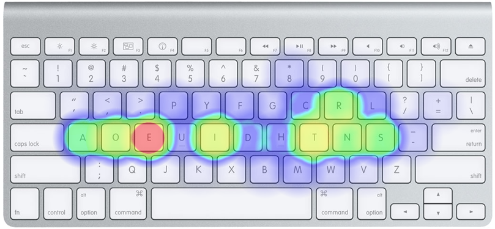

但是这个键位不能满足程序员的需求，因为编程的时候不需要频繁的输入数字，需要频繁输入那些符号。而德沃夏克键位输入符号要按`Shift`，非常麻烦。于是程序员版德沃夏克键位就诞生了。

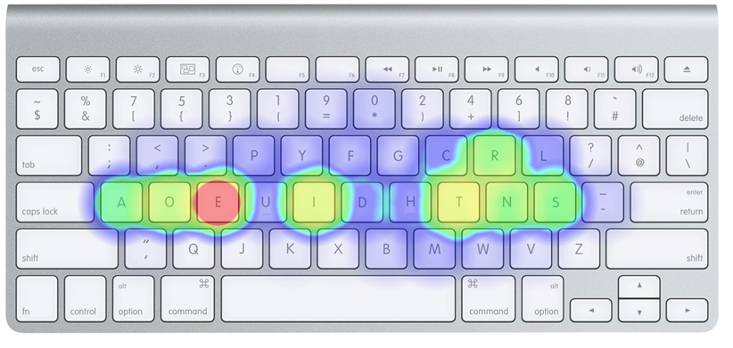

但是这个键盘键位不能令我满意，因为`Ctrl`、`Alt`和`TAB`太难按了而且不对称，而`Caps Lock`这个我从来不用的按键和极少使用的`Win`键占据了那么好的位置。于是胡氏德沃夏克键位就诞生了。

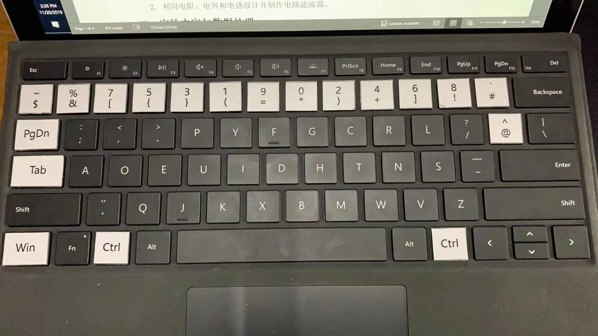

### 胡氏德沃夏克键盘键位的安装

详见我的GitHub
* [Linux](https://github.com/XipingHu/hxp-dvorak-ubuntu)
* [Windows](https://github.com/XipingHu/hxp-dvorak-windows)

### 胡氏键盘键位适应需要多久？换成这个键位后能否在正常键位上打字？

我的亲身实践表明，适应这个键位需要95天。而且在适应了这个键位后交替使用正常键位和胡氏键位几天后，两种键位都能愉快打字。人是可以同时安装两种键位的。

# 任何问题欢迎在这个GitHub仓库发issue，或者直接QQ联系。如果想改进这个文档欢迎给我发PR！
